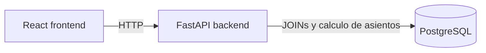
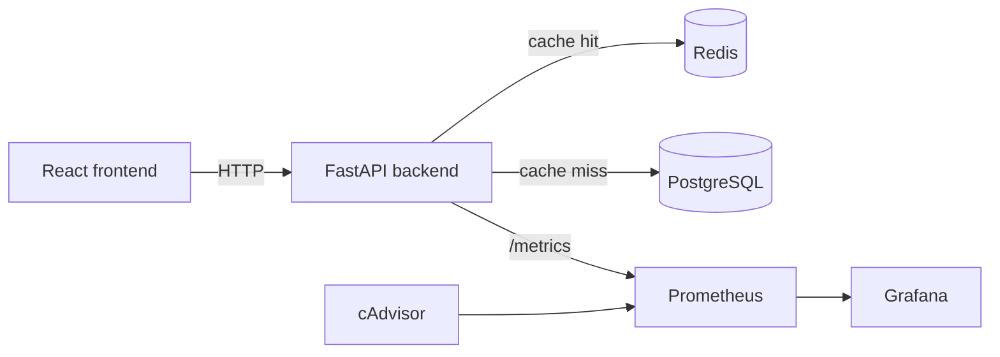

# SkyConnect Airlines - Hito 3

Optimizacion y escalabilidad de una plataforma de venta de pasajes aereos bajo
alta concurrencia.

Este repositorio contiene el sistema base FastAPI + React + PostgreSQL y las
mejoras requeridas para el Hito 3: Redis como cache, Prometheus, Grafana,
cAdvisor, Locust y documentacion tecnica reproducible.

## Stack

| Capa | Tecnologia |
| --- | --- |
| Frontend | React + Vite + Axios + Bootstrap |
| Backend | FastAPI + SQLAlchemy + prometheus-client |
| Base de datos | PostgreSQL 16 |
| Cache | Redis 7 |
| Observabilidad | Prometheus + Grafana + cAdvisor |
| Pruebas de carga | Locust |
| Orquestacion | Docker Compose |

## Arquitectura original



El cuello de botella principal era `GET /flights`, porque cada request ejecutaba
consultas con joins entre `flights`, `routes`, `aircraft` y `bookings` para
calcular asientos disponibles.

## Arquitectura optimizada



## Servicios Docker

| Servicio | URL |
| --- | --- |
| Frontend | http://localhost:3002 |
| Backend API | http://localhost:8001 |
| API Docs | http://localhost:8001/docs |
| Prometheus | http://localhost:9090 |
| Grafana | http://localhost:3001 (`admin` / `admin`) |
| Locust | http://localhost:8089 |
| cAdvisor | http://localhost:8080 |
| Redis | localhost:6380 |
| PostgreSQL | localhost:5433 |

## Levantar el sistema

```bash
docker compose up --build
```

Verificaciones rapidas:

```bash
curl http://localhost:8001/health
curl http://localhost:8001/flights
curl http://localhost:8001/routes
curl http://localhost:8001/aircraft
curl http://localhost:8001/metrics
docker compose exec redis redis-cli ping
```

Si cambias `db/init.sql` y ya existe el volumen local de PostgreSQL, reinicia la
base para reejecutar el seed:

```bash
docker compose down -v
docker compose up --build
```

## Cache Redis

La estrategia implementada es cache-aside:

1. El endpoint busca primero una clave en Redis.
2. Si existe, retorna el JSON cacheado y registra `cache_hits_total`.
3. Si no existe, consulta PostgreSQL, serializa la respuesta, la guarda con TTL y
   registra `cache_misses_total`.

| Endpoint | Clave Redis | TTL |
| --- | --- | --- |
| `GET /flights` | `flights:all` | 60 segundos |
| `GET /routes` | `routes:all` | 300 segundos |
| `GET /aircraft` | `aircraft:all` | 300 segundos |

Como el sistema base no tiene endpoints de escritura para compras o reservas, la
invalidacion efectiva se realiza por TTL. El backend incluye la funcion
`invalidate_cache_keys()` en `backend/app/cache.py` para borrar claves si luego
se agregan operaciones de escritura, por ejemplo al confirmar una reserva.

Para levantar una linea base sin cache, usar:

```powershell
$env:CACHE_ENABLED='false'
docker compose up --build
```

Para volver al escenario optimizado:

```powershell
$env:CACHE_ENABLED='true'
docker compose up --build
```

En Bash:

```bash
CACHE_ENABLED=false docker compose up --build
CACHE_ENABLED=true docker compose up --build
```

## Metricas Prometheus

El backend expone `/metrics` con:

| Metrica | Uso |
| --- | --- |
| `http_requests_total` | Requests por metodo, endpoint y status |
| `http_request_duration_seconds` | Histograma de latencia, permite P95 |
| `cache_hits_total` | Hits de Redis por endpoint |
| `cache_misses_total` | Misses de Redis por endpoint |

Prometheus tambien scrapea cAdvisor para CPU y memoria por contenedor.

Consultas utiles:

```promql
histogram_quantile(0.95, sum(rate(http_request_duration_seconds_bucket{endpoint="/flights"}[1m])) by (le))
sum(rate(cache_hits_total[1m])) / (sum(rate(cache_hits_total[1m])) + sum(rate(cache_misses_total[1m])))
sum(rate(http_requests_total[1m])) by (endpoint)
```

## Grafana

Grafana queda provisionado automaticamente con:

- Datasource Prometheus: `monitoring/grafana/provisioning/datasources/prometheus.yml`
- Dashboard exportado: `monitoring/grafana/dashboards/skyconnect-performance.json`

El dashboard muestra latencia promedio, P95, requests por segundo, CPU, memoria,
cache hit ratio, hits/misses y errores 5xx.

## Pruebas de carga

Los resultados deben guardarse en `results/`. Los CSV estan ignorados por Git
para evitar subir evidencia generada o editada manualmente.

Linea base sin cache:

```powershell
$env:CACHE_ENABLED='false'
docker compose up --build
docker compose run --rm locust locust -f locustfile.py --host=http://backend:8000 --users 1000 --spawn-rate 50 --run-time 5m --headless --csv=results/before
```

Escenario optimizado con Redis:

```powershell
$env:CACHE_ENABLED='true'
docker compose up --build
docker compose run --rm locust locust -f locustfile.py --host=http://backend:8000 --users 1000 --spawn-rate 50 --run-time 5m --headless --csv=results/after-redis
```

Prueba corta de humo:

```bash
docker compose run --rm locust locust -f locustfile.py --host=http://backend:8000 --users 10 --spawn-rate 5 --run-time 30s --headless --csv=results/smoke
```

Archivos esperados por escenario:

- `results/before_stats.csv`
- `results/before_stats_history.csv`
- `results/before_failures.csv`
- `results/after-redis_stats.csv`
- `results/after-redis_stats_history.csv`
- `results/after-redis_failures.csv`

## Optimizaciones PostgreSQL

`db/init.sql` agrega indices adicionales para apoyar el endpoint critico:

- `idx_flights_route_departure` sobre `flights(route_id, departure_date)`
- `idx_flights_status_departure` sobre `flights(status, departure_date)`
- `idx_bookings_flight_status` sobre `bookings(flight_id, status)`

Estos indices reducen trabajo al ordenar vuelos, filtrar estados y agrupar
reservas confirmadas por vuelo.

## Justificacion tecnica

Redis reduce lecturas repetidas contra PostgreSQL durante eventos de alta
concurrencia. El TTL de vuelos es corto porque la disponibilidad puede cambiar;
los catalogos de rutas y aeronaves usan TTL mayor porque son datos estables.
Prometheus y Grafana permiten validar el impacto con metricas objetivas en vez
de suposiciones.

## Justificacion economica estimada

La mejora prioriza una capa Redis liviana antes de escalar verticalmente la base
de datos. En un escenario cloud, una instancia Redis pequena suele costar menos
que aumentar CPU/RAM de PostgreSQL para absorber lecturas identicas. El beneficio
esperado es menor latencia, menor tasa de timeout y mejor continuidad de ventas
durante Cyber Day. Los valores finales de ROI deben calcularse con los CSV reales
de Locust y los costos de infraestructura elegidos por el equipo.

## Documentacion

- `docs/informe-tecnico.md`
- `docs/diagramas.md`
- `docs/resultados-pruebas.md`

## Uso de IA

La implementacion y documentacion fueron asistidas por Codex/IA. El equipo debe
revisar el codigo, ejecutar las pruebas reales, validar los dashboards y ser
capaz de explicar cada cambio durante la presentacion.
