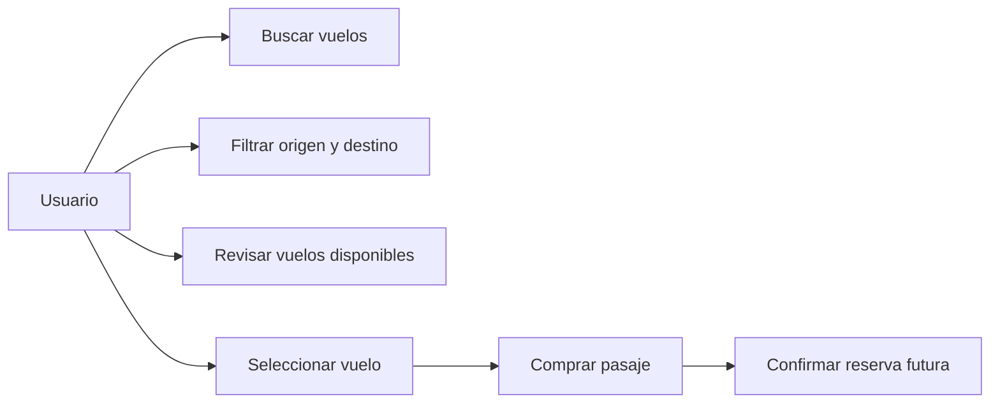
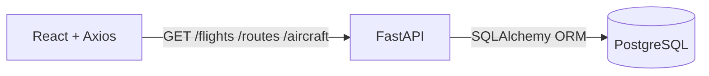
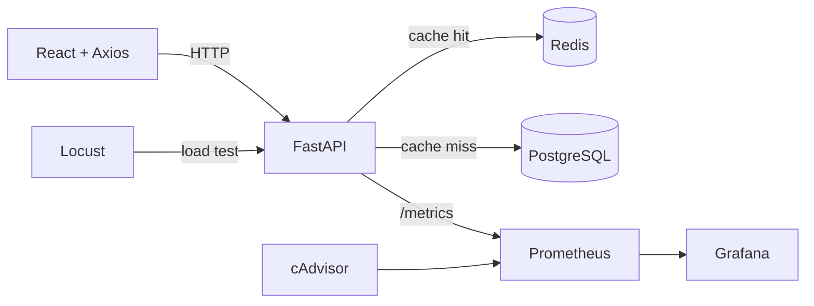
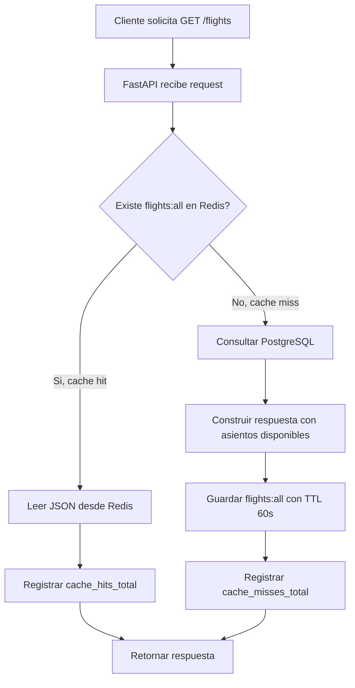
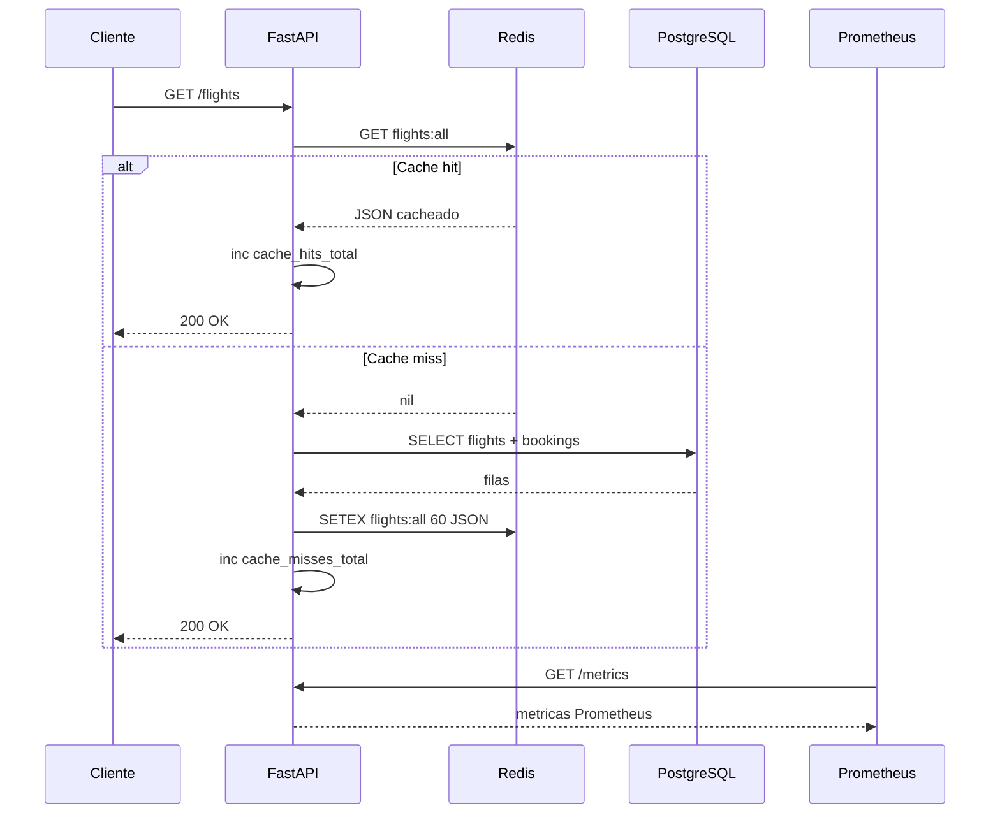

# Diagramas tecnicos

## Casos de uso

```mermaid
flowchart LR
  U[Usuario] --> A[Buscar vuelos]
  U --> B[Filtrar origen y destino]
  U --> C[Revisar vuelos disponibles]
  U --> D[Seleccionar vuelo]
  D --> E[Comprar pasaje]
  E --> F[Confirmar reserva futura]
```

## Arquitectura original

```mermaid
flowchart LR
  FE[React + Axios] -->|GET /flights /routes /aircraft| API[FastAPI]
  API -->|SQLAlchemy ORM| DB[(PostgreSQL)]
```

## Arquitectura optimizada

```mermaid
flowchart LR
  FE[React + Axios] -->|HTTP| API[FastAPI]
  API -->|cache hit| REDIS[(Redis)]
  API -->|cache miss| DB[(PostgreSQL)]
  API -->|/metrics| PROM[Prometheus]
  CAD[cAdvisor] --> PROM
  PROM --> GRAF[Grafana]
  LOC[Locust] -->|load test| API
```

## Flujo GET /flights con Redis

```mermaid
flowchart TD
  A[Cliente solicita GET /flights] --> B[FastAPI recibe request]
  B --> C{Existe flights:all en Redis?}
  C -->|Si, cache hit| D[Leer JSON desde Redis]
  D --> E[Registrar cache_hits_total]
  E --> F[Retornar respuesta]
  C -->|No, cache miss| G[Consultar PostgreSQL]
  G --> H[Construir respuesta con asientos disponibles]
  H --> I[Guardar flights:all con TTL 60s]
  I --> J[Registrar cache_misses_total]
  J --> F
```

## Secuencia de cache

```mermaid
sequenceDiagram
  participant C as Cliente
  participant API as FastAPI
  participant R as Redis
  participant DB as PostgreSQL
  participant P as Prometheus

  C->>API: GET /flights
  API->>R: GET flights:all
  alt Cache hit
    R-->>API: JSON cacheado
    API->>API: inc cache_hits_total
    API-->>C: 200 OK
  else Cache miss
    R-->>API: nil
    API->>DB: SELECT flights + bookings
    DB-->>API: filas
    API->>R: SETEX flights:all 60 JSON
    API->>API: inc cache_misses_total
    API-->>C: 200 OK
  end
  P->>API: GET /metrics
  API-->>P: metricas Prometheus
```
