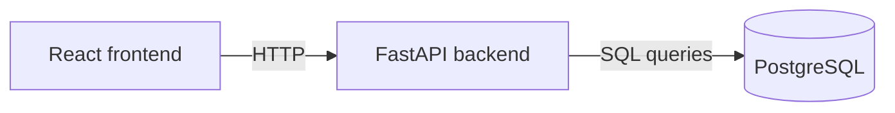
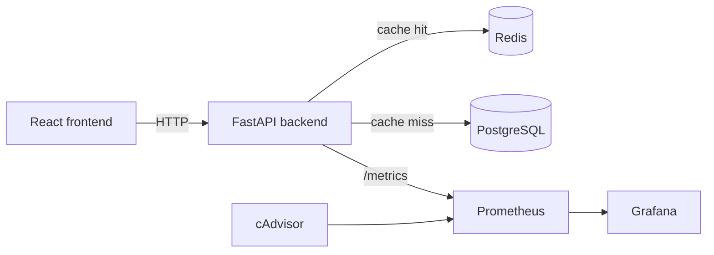

# Informe tecnico - Hito 3 SkyConnect Airlines

## 1. Diagnostico inicial

El sistema base expone una aplicacion React que consume una API FastAPI conectada
a PostgreSQL. El endpoint critico es `GET /flights`, porque entrega el listado de
vuelos junto con ruta, aeronave y asientos disponibles.

La operacion costosa ocurre al calcular disponibilidad: el backend debe unir
`flights`, `routes`, `aircraft` y `bookings`, agrupar reservas por vuelo y ordenar
por fecha de salida. Bajo alta concurrencia, muchas solicitudes leen el mismo
resultado y presionan innecesariamente la base de datos.

## 2. Identificacion de cuellos de botella

Cuellos de botella identificados:

- Lecturas repetidas de `GET /flights` contra PostgreSQL.
- Calculo dinamico de reservas confirmadas por vuelo.
- Falta de cache para datos de catalogo (`routes` y `aircraft`).
- Ausencia inicial de metricas comparables de latencia, P95, RPS y errores.

La evidencia cuantitativa debe completarse ejecutando Locust con cache apagada y
cache encendida, guardando los CSV en `results/`.

## 3. Arquitectura original



La arquitectura original es funcional, pero escala mal cuando muchas solicitudes
identicas consultan vuelos al mismo tiempo.

## 4. Arquitectura optimizada



Componentes agregados:

- Redis para cache-aside.
- Prometheus para recolectar metricas.
- Grafana para visualizar latencia, P95, throughput, CPU, memoria y cache hit ratio.
- cAdvisor para metricas de CPU y memoria por contenedor.

## 5. Mejoras implementadas

### Redis cache-aside

Endpoints cacheados:

| Endpoint | Clave | TTL |
| --- | --- | --- |
| `GET /flights` | `flights:all` | 60 s |
| `GET /routes` | `routes:all` | 300 s |
| `GET /aircraft` | `aircraft:all` | 300 s |

La invalidacion actual se basa en TTL porque no existen endpoints de escritura.
Se dejo `invalidate_cache_keys()` para invalidacion explicita futura.

### Metricas Prometheus

Se expone `/metrics` desde FastAPI con:

- `http_requests_total`
- `http_request_duration_seconds`
- `cache_hits_total`
- `cache_misses_total`

### Observabilidad

Prometheus scrapea backend y cAdvisor. Grafana se provisiona automaticamente con
un dashboard exportado en JSON.

### Indices PostgreSQL

Se agregaron indices sobre fecha/estado de vuelos y reservas por vuelo/estado.
Estos indices respaldan el caso en que Redis tenga cache miss o este deshabilitado
para medicion base.

## 6. Metricas comparativas

No se incluyen datos inventados. Completar esta tabla despues de ejecutar las
pruebas reales:

| Escenario | Avg /flights | P95 /flights | RPS total | Error rate | Cache hit ratio |
| --- | ---: | ---: | ---: | ---: | ---: |
| Before - cache off | Pendiente | Pendiente | Pendiente | Pendiente | 0% esperado |
| After Redis - cache on | Pendiente | Pendiente | Pendiente | Pendiente | >70% esperado |

Comandos:

```bash
CACHE_ENABLED=false docker compose up --build
docker compose run --rm locust locust -f locustfile.py --host=http://backend:8000 --users 1000 --spawn-rate 50 --run-time 5m --headless --csv=results/before

CACHE_ENABLED=true docker compose up --build
docker compose run --rm locust locust -f locustfile.py --host=http://backend:8000 --users 1000 --spawn-rate 50 --run-time 5m --headless --csv=results/after-redis
```

## 7. Justificacion economica

Redis ataca el problema de forma costo-efectiva: evita lecturas repetidas en
PostgreSQL sin cambiar el modelo de negocio ni reescribir el backend. Frente a
una alternativa de escalar verticalmente PostgreSQL, una capa Redis pequena suele
tener menor costo operativo para absorber lecturas identicas durante picos.

El beneficio economico esperado proviene de:

- Menor latencia en busquedas.
- Menor probabilidad de timeout durante Cyber Day.
- Menor carga sobre PostgreSQL.
- Mejor continuidad de ventas durante trafico alto.

El ROI final debe calcularse usando los resultados reales y costos de la
infraestructura definida por el equipo.

## 8. Evaluacion esfuerzo vs. beneficio

| Mejora | Esfuerzo | Beneficio esperado | Evaluacion |
| --- | --- | --- | --- |
| Redis cache-aside | Medio | Alto | Prioritaria, reduce lecturas repetidas |
| Metricas Prometheus | Medio | Alto | Necesaria para demostrar impacto |
| Grafana + cAdvisor | Medio | Medio/Alto | Facilita evidencia visual y operacional |
| Indices PostgreSQL | Bajo | Medio | Mejora misses y baseline |

La mejor relacion esfuerzo/beneficio es Redis en `GET /flights`, porque el
trafico del escenario de carga se concentra en ese endpoint.
